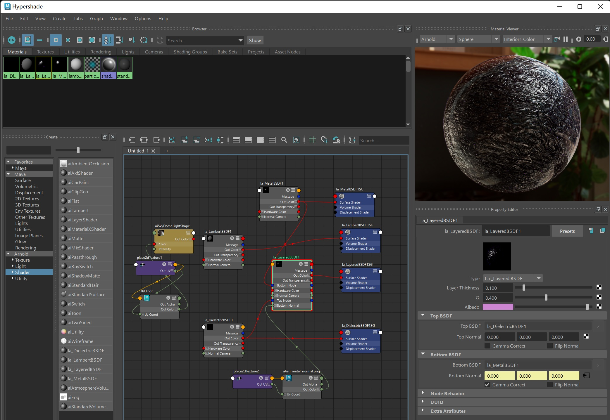

# LayerMatNode

|  |  |
| ------------------ | ------------------ |

### Introduction

- LayerMatNode is a Maya Arnold plugin for rendering surfaces with layered material. With a few shader nodes you can easily create a range of surface appearances with texture-mappable parameters
- The BSDF model is derived from the paper [Position-Free Monte Carlo Simulation for Arbitrary Layered BSDFs, Guo Yu et al.]() and promoted by PBRT as a standard. We further made it a usable tool

### Contributors

- [Chang Liu](https://github.com/HummaWhite), UPenn CGGT
- [Gehan Zheng](https://github.com/GrahamZen), UPenn CGGT

### Demo Video

- https://drive.google.com/file/d/1j2lDRicSBbojKYuCwUnV30WpUK_f266z/view?usp=sharing

### Setup

#### Setting environment variables

- `ARNOLD_PATH` to `C:\Program Files\Autodesk\Arnold\maya2023`

- `ARNOLD_PLUGIN_PATH` to `your plugin folder`, in this case is `/plugin` of this project
- `MTOA_TEMPLATES_PATH` the same as `ARNOLD_PLUGIN_PATH`
- Add `%ARNOLD_PATH%\bin` to your system's `PATH` variable

#### Building plugin

- Clone
- Generate Visual Studio project with CMake
- Build

#### Loading and testing the plugin

- If environment variables are set properly, then Maya and Arnold will automatically load the plugin

#### Arnold for Maya development handbook

- [https://help.autodesk.com/view/ARNOL/ENU/?guid=arnold_dev_guide_plugins_html](https://help.autodesk.com/view/ARNOL/ENU/?guid=arnold_dev_guide_plugins_html)